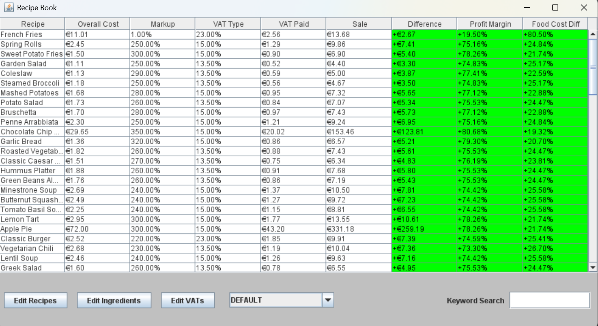
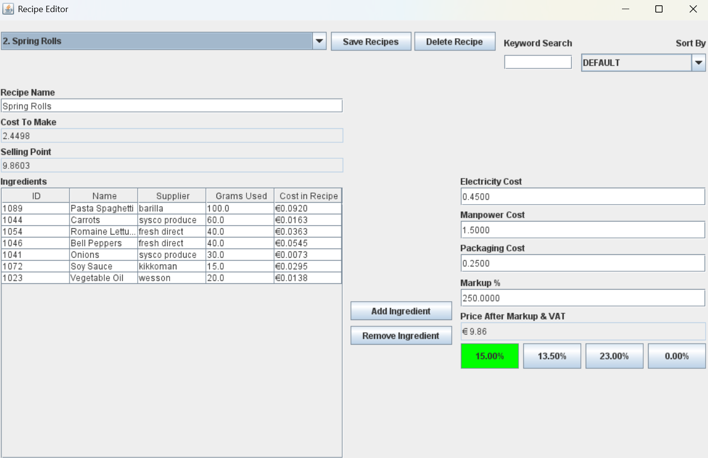
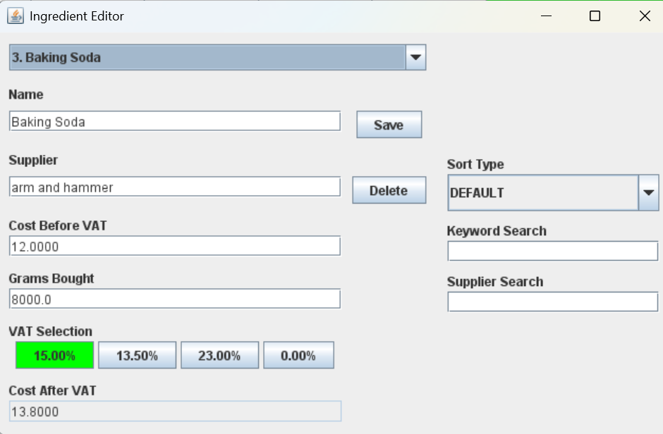
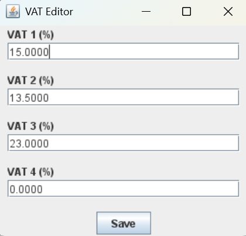
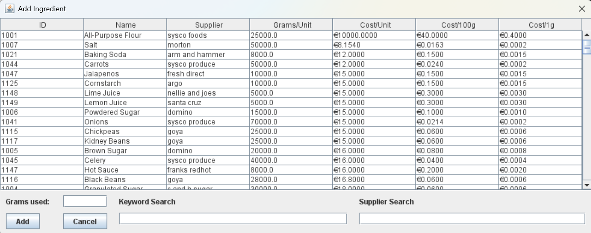

# RecipeProfitizer

A Java Swing desktop application for managing food ingredients and recipes. It calculates production costs, recommended selling prices, and profit margins while handling overheads and VAT.

## Features

- **Ingredient Management** — Add, edit, and delete ingredients with supplier info, unit cost, and weight. Assign one of four configurable VAT rates to each ingredient.
- **Recipe Builder** — Compose recipes from your ingredient database, with adjustable overhead costs (manpower, electricity, packaging) and markup percentages.
- **Automated Costing** — Calculates cost-to-make (including overheads and VAT), suggested selling price (based on markup and VAT), and net profit per recipe.
- **Financial Analytics** — View profit margin, food cost percentage, and net profit at a glance.
- **VAT Editor** — Configure up to four global tax rates. Changing a rate automatically recalculates every ingredient and recipe that uses it.
- **Search & Filter** — Quickly find ingredients by name or supplier.
- **Data Persistence** — All data is saved and loaded from local text files (`recipes.txt`, `ingredients.txt`, `vatFile.txt`, `idfile.txt`).

## Screenshots











## Getting Started

### Prerequisites

- **Java 8+** (built with standard `javax.swing` and `java.awt` libraries — no external dependencies)
- Read/write access to the application's root directory for data files

### Running the Application

1. Compile and run the `Main` class.
2. **Configure VAT** — Open the VAT Editor from the dashboard to set your local tax rates.
3. **Add Ingredients** — Use the Ingredient Editor to populate your database, selecting the correct VAT rate for each item.
4. **Create Recipes** — Use the Recipe Frame to build recipes, set overhead costs, and choose your desired markup percentage.

## Project Structure

```
src/myGUI/
├── Main.java                 # Entry point
├── MyFrame.java              # Primary dashboard
├── MyPanel.java              # Main panel with recipe list
├── RecipeFrame.java          # Recipe editor
├── IngredientFrame.java      # Ingredient editor
├── AddIngredientDialog.java  # Dialog for adding ingredients
└── VATFrame.java             # VAT rate editor
```

## AI Acknowledgement

From commit [`c4e8e0b`](../../commit/c4e8e0b) onwards, AI (Claude by Anthropic) has assisted in the development of this project. Specifically, AI was used for:

- **Layout refactor** — Migrating from absolute positioning to `BorderLayout` and `GridBagLayout`
- **VAT integration** — Integrating VAT handling, calculation, and UI throughout the application
- **Boilerplate refactoring** — Consolidating repetitive code into shared methods
- **Code review** — Identifying bugs, improving error handling, and replacing silent exceptions with user-visible dialogs
- **General tidiness** — Code formatting, section headers, and overall readability improvements

All AI-assisted changes were reviewed and directed by the project author.

## License

This project is not currently under a formal licence.
